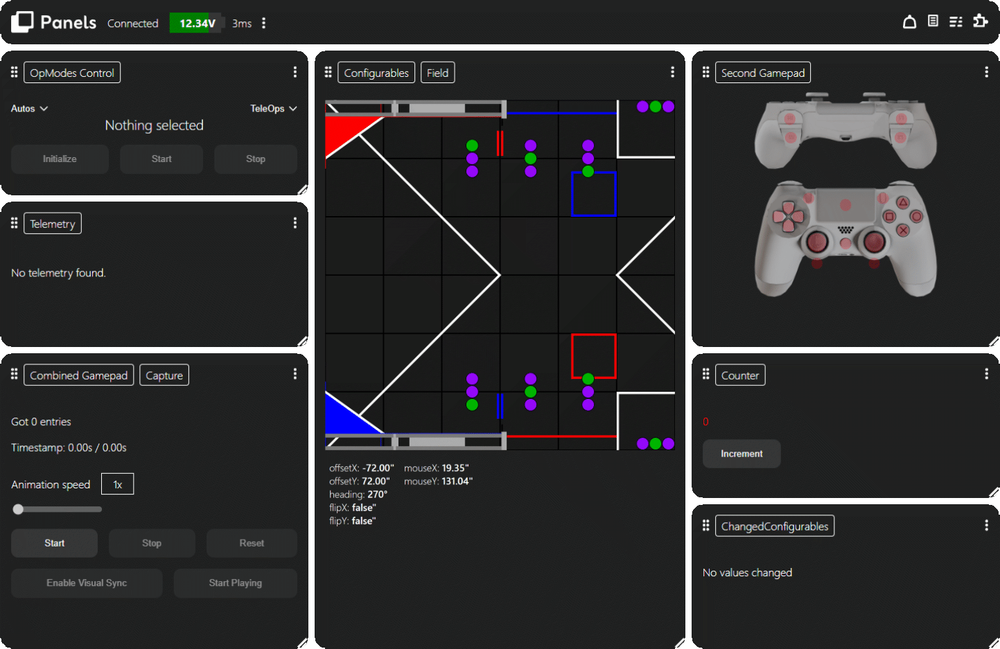
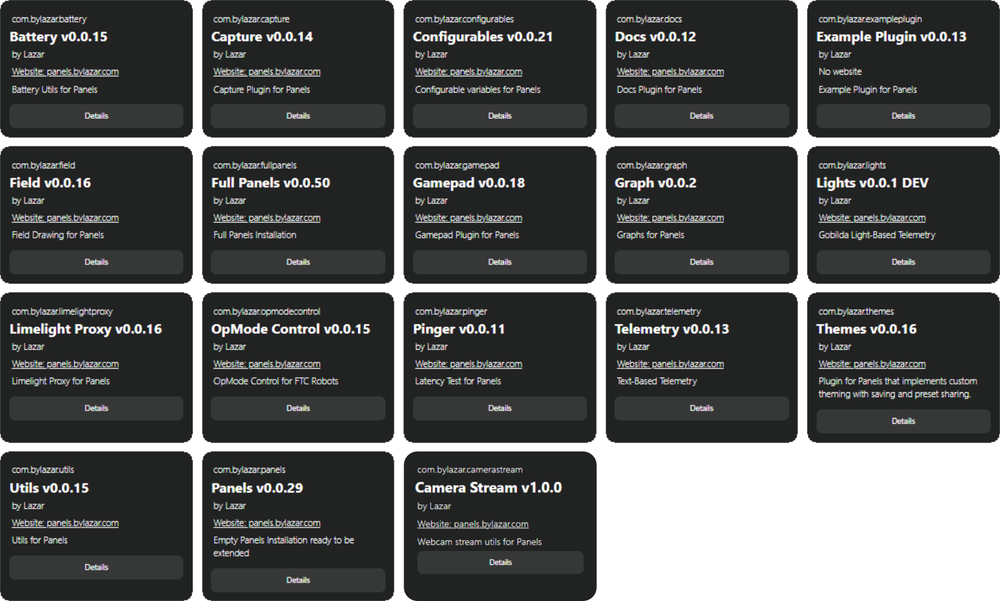

# Panels Enhancement for FTC (Team 19859)



This repository is FTC Team 19859's enhancement fork of Panels, focused on improving UI/UX quality, workflow clarity, and frontend testability while preserving real FTC runtime behavior.



## What This Fork Changes

This fork is intentionally feature-preserving and enhancement-focused.

- Comprehensive UI/UX redesign across core frontend surfaces.
- Stronger design system consistency (spacing, hierarchy, readability, responsive polish).
- Improved shell, topbar, widget chrome, overlays, chooser surfaces, plugin/docs views, and notifications UI.
- Improved mock-demo experience for frontend iteration without robot hardware.
- Clear documentation for real FTC runtime path vs standalone mock/demo path.

## Feature Preservation Guarantee

Major capabilities are intentionally preserved in this fork:

- Graphs
- Telemetry
- Field view
- Capture-related workflows
- OpMode control
- Configurables
- Gamepad UI
- Widgets/panels/plugin system
- Layout interactions (tabs, resizing, grouping, template/preset operations)

No intentional feature pruning has been performed as part of this enhancement fork.

## Runtime Targets

This repo contains two separate targets:

- Real FTC runtime path: `library/` + `examples/`
- Standalone frontend testing/demo path: `mock-demo/`

The mock demo is isolated and does not replace robot-side FTC deployment.

## Local Development

### Mock demo

```sh
cd mock-demo
npm install
npm run dev
```

### Docs site

```sh
cd docs
npm install
npm run dev
```

## Render Deployment

### Docs site

- Root Directory: `docs`
- Build Command: `npm install && npm run build`
- Publish Directory: `build`

### Mock demo

- Root Directory: `mock-demo`
- Build Command: `npm install && npm run build`
- Publish Directory: `dist`

## Upstream Credit

Original Panels project by Lazar (Team 19234 ByteForce):

- https://bylazar.com
- https://panels.bylazar.com
